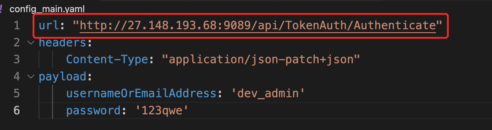
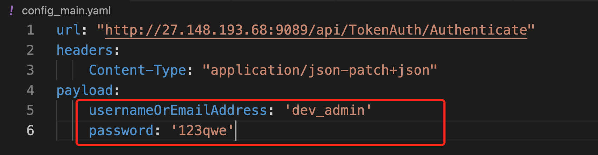
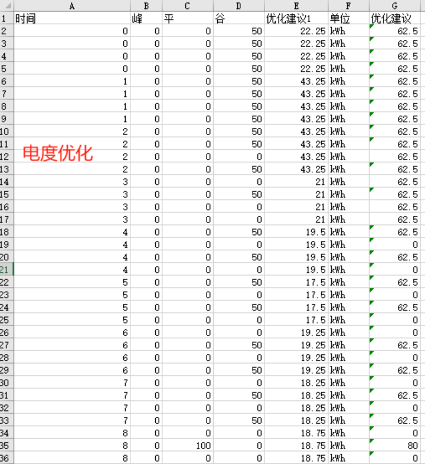
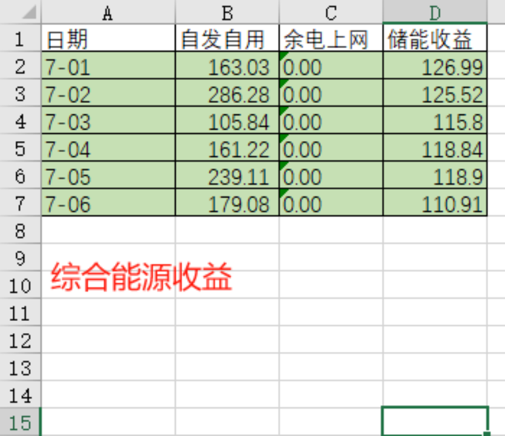
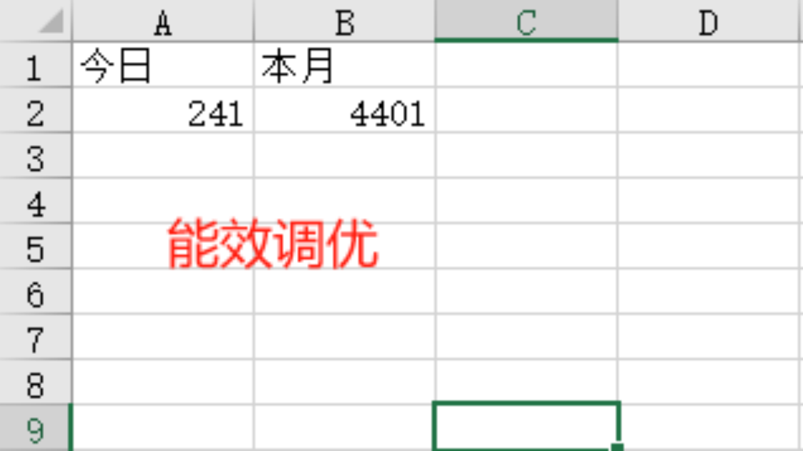
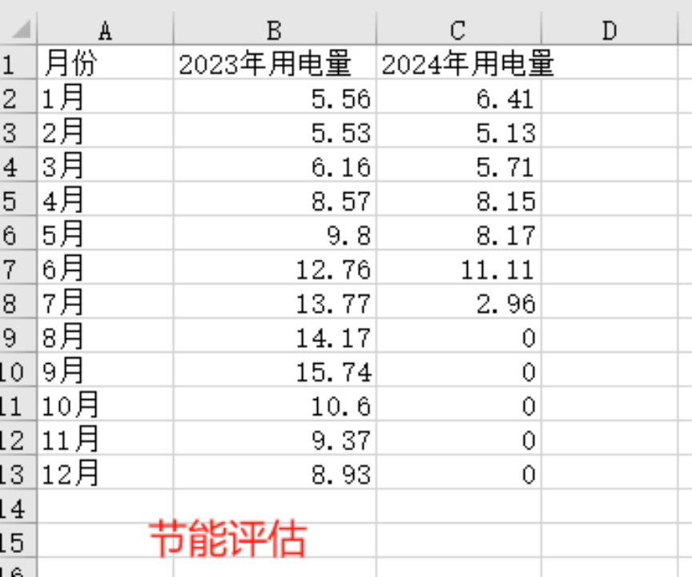

# Intelligent Energy Management System 

## Test
In order to use this program to extract and process data from given API, you can just follow the steps shown as below：

**1. Modify the IP address and user's information to conform to particular space:**
Open `config_main.yaml` and modify the url to where you want to access:


Input the right username and password:


**2. Run script in your terminal:**
We assume that you already have an anaconda base environment. In this case, you only need to run the following command in your terminal:
```bash
python main.py
```

## Expected Results
The program will export four csv files for four different usages:

`ElectricityOptimization_demo3_output1.csv`:


`EnergyConservingBenefit_demo1_output1.csv`:


`EnergyTuning_demo1_output1.csv`:


`SynthesizeEnergyIncome_demo1_output1.csv`:
